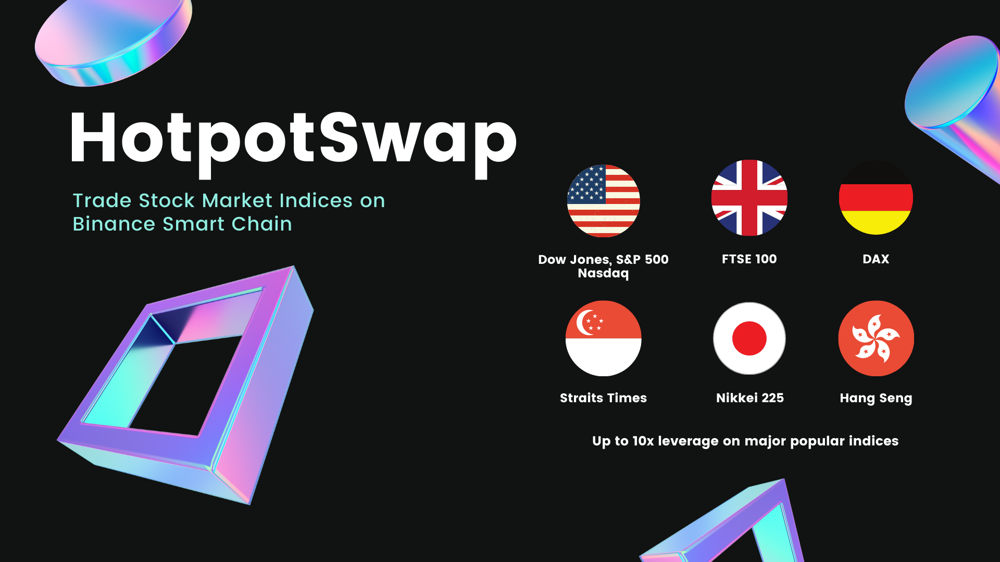
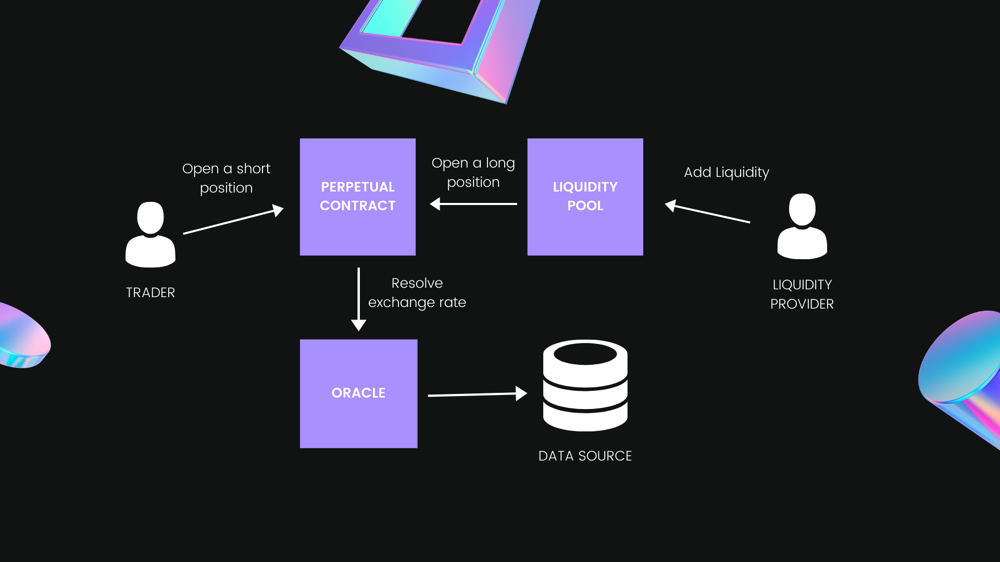

# HotpotSwap



This monorepo contains all Solidity smart contracts, apps and services for the HotpotSwap platform which allows trade stock market indices in the form of cryptocurrency synthetic assets via perpetual swap contracts. 

The project is under heavy development and currently live on BSC Testnet and Kovan network only, check out at: [https://hotpotswap.fi](https://hotpotswap.fi)

## Motivation

We've seen stock market indices such as Nasdaq, S&P 500, Dow Jones,... on every business news much more than crypto prices. Why can't we trade against them?

## Overview

We formulate this idea during Binance Virtual Hackathon 2021 and evaluate a number of perpetual contract project from MCDEX v2, Perpetual protocol to UMA protocol. Eventually, we brought core logic mostly from MCDEX v2 protocol to implement this project that applying continuous funding rate and AMM to perpetual contracts.

### What does it currently do

* Trader can short and long Dow Jones Index with BUSD and he/she will need to maintain the position above liquidation ratio.
* Funding occurs when the trader execute the order or either been triggered by the price feeder bot that runs every hour.
* Stock market indices are observed by internal oracle that fetch the data from Tradermade API.
* Liquidity provider can help balance AMM towards the mark price by selling LP tokens and get some profit.

### Road to BSC Mainnet

The main lesson learned from the early version of this project are:

* Using AMM is costly and difficult to control the slippage rate, the problem will be worst when multiple pools are launched.
* Involved with complex math calculation that our team are not effectively capable with.

In order to overcome above statements, we're planning to do major improvement works to smart contrat side with following:
* Replace AMM with off-chain order books.
* Replace on-chain funding rate mechanism with off-chain approach.
* All off-chain facilities are going to managed by project team members at the beginning and the set of validators in the future.
* Seperate UI for trader and liquidity provider.
* Implement the medianizer contract which gathers data feeds from different sources and make it through Chainlink's Operator node.

We strive to provide the hybird perpetual contract solution rather than fully decentralized on-chain as we're more expert at scaling cloud infrastructure to serve a huge number of users that would have better UX for all.

## How it works



Every perpetual contract has its internal AMM that holding 2 tokens at the same weight when it's balanced. When the trader open either short or long position, the liquidity pool will execute an order on the opposide side automatically.

### Funding

It's a mechanism to tether contracts to their underlying spot prices, every position holders will either pay or receive funding periodically and this is how the perpetual swap could be exciting than other derivative instruments. 

## Video Demo

[https://youtu.be/8o5UOmL_JWw](https://youtu.be/8o5UOmL_JWw) (Subtitled)

## Install

The project comprises of 3 components.

Install all dependencies in one-go at the root folder by

```
yarn
```

### Solidity contracts

To deploy all contracts in local ganache (make sure you have Truffle suite)

```
cd core
truffle compile
truffle migration
```

### Frontend Dapp

This made by react-create-app that compatible to most modern browsers, to run it locally just run

```
cd client
yarn start
```

### Backend

Where the bots are running and keep a lookout for stock market indices from TraderMade API as a hourly basis. We're using [Pulumi](https://www.pulumi.com/) as a automation tool for setup infrastucture on AWS cloud.

Ensure that you have Pulumi CLI in the your machine and then run.

```
cd backend
pulumi up
```

## Smart Contracts

### BSC Testnet

Contract Name | Contract Address 
--- | --- 
BUSD Token | 0xb31E9e3446767AaDe9E48C4B1B6D13Cc6eDce172 
Perpetual | 0x3a5e7db2E0EA9e69fB53Cd8582e64D4001746E8c
AMM | 0xda87577f9eb8B15B26C00619FD06d4485880310D
Price Feeder | 0x082f8785D466eb39Ee2779b582523EA532258332

### Kovan

Contract Name | Contract Address 
--- | --- 
BUSD Token | 0x11cd798554CFa738c7Aa199693E76c56F6eA221F 
Perpetual | 0x71d010EeFb6d629e9E7ad9e7650c17F97078AFa9
AMM | 0x4D97Bd8eFaCf46b33c4438Ed0B7B6AABfa2359FB
Price Feeder | 0x504293bB9EE4842C7c8040C0A17Ba8064681D150

## License

* Open-source [MIT](LICENSE)


